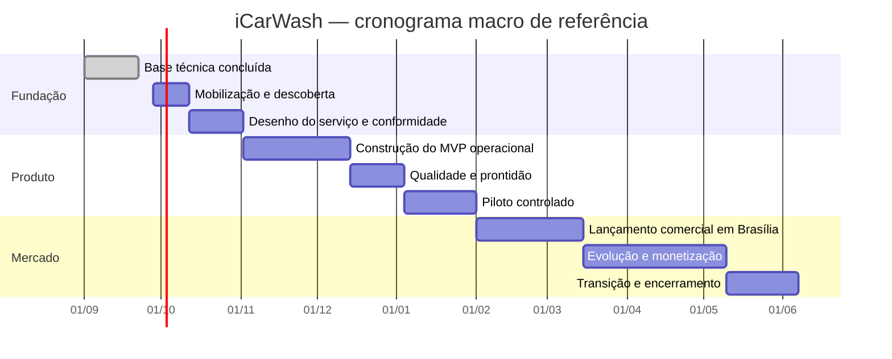

# Plano Macro do Projeto iCarWash

**Versão:** 1.0  
**Data-base:** 22 de setembro de 2026  
**Status:** proposta para aprovação e detalhamento progressivo  
**Autor:** Manus AI  
**Horizonte de referência:** 36 semanas  
**Região piloto:** Brasília, Distrito Federal, Brasil

## 1. Resumo executivo

O **iCarWash** é um marketplace que conecta clientes a estabelecimentos e profissionais de lavagem automotiva. O produto atende duas modalidades: lavagem no estabelecimento e atendimento no endereço do cliente. A plataforma deve sugerir opções próximas, apresentar serviços e horários, registrar solicitações de agendamento e permitir que o parceiro confirme ou rejeite cada pedido.

O projeto será conduzido por uma abordagem **híbrida**. A governança, os marcos de investimento e as decisões de continuidade seguirão uma lógica preditiva, com fases, linhas de base e critérios de aprovação. O desenvolvimento do produto ocorrerá de forma adaptativa, em ciclos de duas semanas, com priorização contínua do backlog, demonstrações e validação com usuários. Essa adaptação é coerente com a orientação do PMI de escolher práticas adequadas ao contexto, ao tamanho e à complexidade do projeto, em vez de aplicar uma metodologia única de forma rígida.[1] [2]

O horizonte de 36 semanas está dividido em oito etapas. A primeira base técnica já existe: repositório próprio, aplicação web, API, banco PostgreSQL em nuvem, busca preliminar por proximidade e fluxo inicial de solicitação de agendamento. O projeto ainda não deve ser tratado como operação comercial pronta. Antes do piloto com clientes reais, são necessários autenticação, portal do parceiro, gestão da agenda, governança operacional, adequação à Lei Geral de Proteção de Dados Pessoais (LGPD), observabilidade, atendimento e validação dos parceiros.

O resultado final esperado é uma operação de marketplace pronta para funcionar em Brasília, com processos repetíveis de aquisição e ativação de parceiros, jornada digital monitorada, indicadores de negócio, controles de segurança e uma arquitetura capaz de evoluir para pagamentos online, roteamento real e expansão geográfica.

## 2. Referencial de gestão e adaptação do PMBOK

A edição atual do **PMBOK® Guide** mantém uma abordagem orientada por princípios e domínios de desempenho. O PMI destaca entrega de valor, adaptação, responsabilização, qualidade, sustentabilidade e equipes capacitadas. Também organiza a prática em sete domínios: governança, escopo, cronograma, finanças, partes interessadas, recursos e riscos.[1]

Este plano traduz esses princípios para um produto digital em estágio inicial. A gestão não será baseada em documentação excessiva. Cada artefato deverá apoiar uma decisão, reduzir risco ou melhorar a entrega. O planejamento será progressivamente detalhado: o horizonte macro ficará sob controle de marcos, enquanto o conteúdo de cada ciclo será refinado à medida que surgirem evidências de usuários e da operação.

| Diretriz PMBOK | Aplicação no iCarWash |
|---|---|
| Foco em valor | Cada incremento precisa melhorar aquisição, conversão, execução do serviço, retenção ou eficiência operacional. |
| Visão sistêmica | Produto, tecnologia, parceiros, atendimento, jurídico, finanças e marketing serão tratados como partes do mesmo sistema. |
| Qualidade incorporada | Segurança, acessibilidade, testes, observabilidade e critérios de aceite fazem parte da definição de pronto. |
| Liderança responsável | Decisões terão proprietário, prazo, evidência e registro. Riscos materiais serão escalados ao patrocinador. |
| Sustentabilidade | O modelo deverá reduzir deslocamentos improdutivos, desperdício operacional e dependência de processos manuais frágeis. |
| Equipe capacitada | O time terá autonomia dentro de objetivos, limites de custo, políticas de segurança e critérios de aceite aprovados. |

## 3. Termo de abertura do projeto

### 3.1 Justificativa

O mercado de lavagem automotiva é fragmentado. O cliente enfrenta dificuldade para comparar serviços, identificar opções próximas, verificar horários e confirmar atendimento. O parceiro, por sua vez, costuma depender de telefone, mensagens e controles manuais, o que reduz previsibilidade e aumenta o risco de horários ociosos, conflitos de agenda e perda de clientes.

O iCarWash pretende reduzir essa fricção por meio de descoberta local, agenda estruturada e acompanhamento do pedido. A região de Brasília será usada para validar a proposta de valor, a operação e a economia unitária antes da expansão.

### 3.2 Objetivo geral

Desenvolver, validar e colocar em operação um marketplace de lavagem automotiva em Brasília que permita descobrir parceiros por proximidade, solicitar e acompanhar agendamentos nas modalidades presencial e móvel e gerar valor mensurável para clientes e prestadores.

### 3.3 Objetivos específicos

1. Disponibilizar uma jornada de busca e agendamento que funcione em dispositivos móveis e navegadores modernos.
2. Implantar autenticação e autorização para clientes, parceiros e administradores.
3. Permitir que parceiros cadastrem serviços, preços, áreas de atendimento e disponibilidade.
4. Implementar confirmação, rejeição, cancelamento e conclusão do atendimento com histórico auditável.
5. Operar um piloto controlado em Brasília com parceiros reais e suporte definido.
6. Medir conversão, tempo de confirmação, taxa de atendimento, cancelamentos, satisfação e recorrência.
7. Estabelecer controles de privacidade, segurança, continuidade, qualidade e gestão de fornecedores.
8. Preparar uma decisão fundamentada de expansão, monetização e investimento ao término do piloto.

### 3.4 Critérios de sucesso do projeto

O projeto será considerado bem-sucedido quando atender simultaneamente aos seguintes critérios:

- A solução comercial estiver disponível em domínio de produção, com monitoramento e processo de recuperação documentado.
- Clientes reais conseguirem pesquisar, solicitar, acompanhar e concluir um atendimento sem intervenção técnica.
- Parceiros conseguirem manter serviços e agenda, responder a solicitações e registrar a conclusão do serviço.
- A operação piloto atingir as metas aprovadas para oferta ativa, conversão, confirmação, conclusão e satisfação.
- Não existirem vulnerabilidades críticas conhecidas nem pendências impeditivas de LGPD, segurança ou operação.
- O patrocinador aprovar o relatório do piloto e uma decisão de continuar, ajustar, pausar ou encerrar o investimento.

As metas numéricas definitivas serão aprovadas na Etapa 1. Como referência inicial, recomenda-se testar: pelo menos 10 parceiros ativados, 100 solicitações válidas no piloto, taxa de confirmação mínima de 70%, taxa de conclusão mínima de 80% sobre os agendamentos confirmados, mediana de confirmação inferior a 15 minutos durante o horário comercial e satisfação média igual ou superior a 4,2 em uma escala de 1 a 5.

### 3.5 Patrocinador, gerente e autoridade

O **patrocinador** aprova orçamento, objetivos, mudanças de alto impacto e passagem pelos marcos. O **gerente do projeto** integra as frentes, administra cronograma, riscos, decisões, comunicação e mudanças. O **Product Owner** responde pelo valor do produto e pela ordem do backlog. Em uma estrutura enxuta, uma pessoa pode acumular os papéis de patrocinador e Product Owner, mas as responsabilidades devem permanecer explícitas.

O gerente pode reorganizar trabalho dentro da linha de base aprovada. Alterações que modifiquem o prazo final em mais de duas semanas, elevem o orçamento em mais de 10%, incluam intermediação financeira, alterem a região piloto ou ampliem o tratamento de dados pessoais exigem decisão do patrocinador.

## 4. Situação atual e linha de base técnica

A primeira fatia funcional já foi implementada e publicada. Ela reduz o risco técnico inicial, mas não elimina os riscos de produto, operação e mercado.

| Componente | Situação em 22/09/2026 | Avaliação |
|---|---|---|
| Repositório | GitHub `cleandrodf/iCarWash`, branch `main` | Concluído |
| Aplicação pública | React e API Node.js na Render | Concluído para demonstração |
| Banco de dados | PostgreSQL gerenciado no Neon | Concluído para MVP |
| Descoberta | Localização do navegador e ordenação por Haversine | Concluído como aproximação |
| Modalidades | Estabelecimento e endereço do cliente | Concluído |
| Agendamento | Solicitação com estado `pending_partner` | Concluído |
| Pagamento | Realizado no local | Mantido no MVP |
| Autenticação | Não implementada | Impeditivo para piloto aberto |
| Portal do parceiro | Não implementado | Impeditivo para piloto aberto |
| Administração e suporte | Não implementados | Impeditivo para operação comercial |
| Dados de parceiros | Dados demonstrativos | Devem ser substituídos |
| Privacidade e termos | Não formalizados | Impeditivo jurídico |
| Observabilidade | Health check básico | Insuficiente para operação comercial |

## 5. Escopo do produto

### 5.1 Escopo incluído até o lançamento comercial em Brasília

O escopo inclui cadastro e autenticação de usuários, gestão de perfis e veículos, busca geográfica, filtros, detalhes de parceiros, catálogo de serviços, agenda, solicitação de agendamento, confirmação ou rejeição pelo parceiro, cancelamento, conclusão, notificações, avaliações pós-serviço, painel administrativo, suporte, trilha de auditoria, termos de uso, política de privacidade, indicadores operacionais e implantação de produção.

Também fazem parte do projeto a aquisição dos primeiros parceiros, o treinamento operacional, a definição de níveis de serviço, o tratamento de incidentes, o acompanhamento do piloto e a preparação da decisão de expansão.

### 5.2 Escopo postergado

A primeira versão comercial não inclui pagamento online, carteira digital, repasse financeiro, roteamento logístico avançado, franquias, fidelidade complexa, publicidade patrocinada, expansão nacional, aplicativo nativo ou otimização automática de preços. Esses itens entram em ondas posteriores somente quando o piloto demonstrar demanda e capacidade operacional.

### 5.3 Critérios para controlar o escopo

Toda solicitação deve indicar o problema, o beneficiário, o resultado esperado, o impacto no cronograma e a métrica afetada. Itens sem vínculo com objetivo, obrigação legal, redução de risco ou aprendizado validável permanecem fora do ciclo corrente. O backlog não substitui a linha de base: mudanças nos resultados, marcos ou limites do projeto passam pelo processo formal de controle de mudanças.

## 6. Estratégia de desenvolvimento e ciclo de vida

O ciclo de vida será **híbrido e incremental**. A visão, o financiamento, os marcos, os controles legais e os critérios de passagem serão geridos de forma preditiva. O produto será construído em ciclos de duas semanas, com descoberta contínua, refinamento, desenvolvimento, testes, demonstração e retrospectiva.

Cada ciclo deverá produzir software potencialmente liberável ou evidência suficiente para descartar uma hipótese. O trabalho será organizado por resultados de negócio, não apenas por componentes técnicos. Um incremento só será considerado concluído quando cumprir a definição de pronto.

### 6.1 Cadência recomendada

- **Planejamento trimestral:** define resultados, orçamento e capacidade para as próximas 12 semanas.
- **Planejamento de ciclo:** seleciona objetivos e itens para duas semanas.
- **Reunião diária:** identifica bloqueios e coordena o trabalho.
- **Refinamento semanal:** prepara requisitos, riscos, critérios de aceite e dependências.
- **Demonstração quinzenal:** apresenta resultados executáveis às partes interessadas.
- **Retrospectiva quinzenal:** ajusta o processo e registra ações de melhoria.
- **Comitê mensal:** revisa benefícios, riscos, finanças, fornecedores e decisões de marco.

### 6.2 Definição de pronto

Uma entrega estará pronta quando tiver critérios de aceite aprovados, revisão de código, testes automatizados pertinentes, validação funcional, documentação atualizada, logs e métricas necessárias, avaliação de segurança proporcional ao risco, migração reversível quando aplicável e aceite do responsável pelo produto. Funcionalidades que tratem dados pessoais também exigem revisão de privacidade.

## 7. Estrutura analítica do projeto

A Estrutura Analítica do Projeto (EAP) agrupa o trabalho em oito frentes principais.

1. **Gestão e governança:** termo de abertura, planos subsidiários, cronograma, orçamento, riscos, mudanças, comunicações e encerramento.
2. **Produto e experiência:** pesquisa, proposta de valor, jornadas, protótipos, conteúdo, acessibilidade e validação.
3. **Marketplace do cliente:** autenticação, perfil, veículos, busca, filtros, agenda, acompanhamento e avaliações.
4. **Portal do parceiro:** onboarding, catálogo, preços, área atendida, agenda, resposta a pedidos, execução e indicadores.
5. **Administração e operação:** cadastro e homologação, moderação, suporte, conciliação operacional, auditoria e relatórios.
6. **Tecnologia e dados:** arquitetura, APIs, banco, geolocalização, integração, testes, observabilidade, segurança e continuidade.
7. **Jurídico e privacidade:** termos, políticas, bases legais, consentimentos, retenção, direitos dos titulares e contratos.
8. **Go-to-market e expansão:** aquisição de parceiros, lançamento, comunicação, métricas, monetização e preparação para novas regiões.

## 8. Cronograma macro, entregas e resultados esperados

O cronograma de 36 semanas pressupõe uma equipe multidisciplinar com capacidade média de seis a oito profissionais. As durações são uma linha de base inicial e devem ser refinadas após estimativa do backlog e confirmação da equipe.

| Etapa | Período | Objetivo | Principais entregas | Resultado esperado | Marco de decisão |
|---|---:|---|---|---|---|
| 0. Base técnica | Concluída | Reduzir incerteza técnica inicial | Aplicação, API, PostgreSQL, descoberta aproximada, agendamento inicial e hospedagem | Prova funcional acessível e repositório versionado | Base aceita |
| 1. Mobilização e descoberta | Semanas 1–2 | Alinhar negócio, usuários, metas e governança | Termo de abertura, mapa de partes interessadas, pesquisa inicial, indicadores, backlog e plano de riscos | Problema, público, valor e critérios de sucesso validados | G1: autorização para construir |
| 2. Desenho do serviço e conformidade | Semanas 3–5 | Projetar a operação completa antes de automatizá-la | Jornadas, blueprint de serviço, regras operacionais, modelo de dados, termos preliminares e plano LGPD | Fluxos do cliente, parceiro e suporte sem lacunas críticas | G2: escopo operacional aprovado |
| 3. Construção do MVP operacional | Semanas 6–11 | Entregar os recursos mínimos para uso real controlado | Autenticação, portal do parceiro, agenda, estados do pedido, notificações básicas e painel administrativo | Fluxo ponta a ponta executável com usuários identificados | G3: entrada em homologação |
| 4. Qualidade e prontidão do piloto | Semanas 12–14 | Reduzir riscos antes de envolver clientes reais | Testes, correções, observabilidade, segurança, runbooks, treinamento e homologação | Solução estável, suportável e aprovada para piloto fechado | G4: go/no-go do piloto |
| 5. Piloto controlado em Brasília | Semanas 15–18 | Validar valor, operação e comportamento real | 10–20 parceiros, campanha limitada, suporte assistido, métricas e relatório semanal | Evidência sobre conversão, confirmação, conclusão, satisfação e falhas | G5: ajustar, escalar ou interromper |
| 6. Preparação e lançamento comercial | Semanas 19–24 | Transformar o piloto em operação repetível | Correções, planos de serviço, domínio, infraestrutura adequada, processos de suporte e campanha de lançamento | Marketplace apto a aquisição contínua em Brasília | G6: lançamento comercial |
| 7. Evolução e monetização | Semanas 25–32 | Melhorar eficiência, receita e diferenciação | Modelo de cobrança, pagamentos se aprovados, rotas, reputação, promoções e analytics avançado | Economia unitária mensurável e experiência mais previsível | G7: decisão de expansão |
| 8. Transição e encerramento | Semanas 33–36 | Transferir o produto para operação contínua | Aceite final, documentação, contratos, indicadores, lições aprendidas e roadmap | Operação responsável pelo serviço e projeto formalmente encerrado | G8: aceite e transição |

## 9. Detalhamento das etapas

### 9.1 Etapa 1 — Mobilização e descoberta

A etapa confirma se o produto resolve um problema relevante para clientes e parceiros. A equipe realizará entrevistas com proprietários de veículos, gestores de lava-rápidos e prestadores móveis. Também mapeará concorrentes, alternativas atuais, disposição para adotar a plataforma e restrições operacionais de Brasília.

As entregas são o termo de abertura aprovado, mapa de partes interessadas, personas provisórias, jornadas atuais, proposta de valor, hipóteses prioritárias, indicadores de sucesso, backlog inicial, matriz de riscos e cronograma refinado.

**Resultado esperado:** decisão objetiva sobre público inicial, bairros prioritários, perfil de parceiro, promessa de valor e desenho do piloto. O marco G1 exige patrocinador definido, metas mensuráveis, capacidade de equipe confirmada e ausência de inviabilidade comercial ou regulatória evidente.

### 9.2 Etapa 2 — Desenho do serviço e conformidade

Esta etapa transforma a experiência digital em uma operação executável. O time definirá como o parceiro entra na plataforma, publica disponibilidade, responde ao pedido, realiza o serviço, registra problemas e recebe avaliação. Também serão definidos cancelamento, atraso, ausência, disputa, suporte e critérios de suspensão de parceiros.

A equipe jurídica e de privacidade deverá mapear dados pessoais, finalidades, bases legais, operadores, retenção, solicitações dos titulares e resposta a incidentes. A LGPD abrange operações como coleta, uso, armazenamento, compartilhamento e eliminação de dados pessoais. Por isso, finalidades e responsabilidades precisam ser definidas antes do piloto real.[3]

**Resultado esperado:** blueprint do serviço, regras de negócio, protótipos testados, inventário de dados, documentos jurídicos preliminares e arquitetura revisada. O marco G2 exige que jornadas excepcionais tenham responsáveis e que nenhum risco jurídico crítico permaneça sem plano de resposta.

### 9.3 Etapa 3 — Construção do MVP operacional

O desenvolvimento será organizado em três ciclos principais. O primeiro cobre identidade e perfis. O segundo cobre a operação do parceiro e o ciclo de vida do pedido. O terceiro cobre administração, notificações e consolidação.

As funcionalidades mínimas incluem cadastro e login, recuperação de acesso, papéis de usuário, veículos do cliente, cadastro do parceiro, serviços, preços, modalidades, raio de atendimento, horários, bloqueios, pedido, confirmação, rejeição, cancelamento, conclusão e histórico. O administrador deverá consultar usuários, parceiros, serviços e agendamentos, além de registrar ações de suporte.

**Resultado esperado:** jornada ponta a ponta executável em ambiente de homologação, com trilha de auditoria e dados isolados por papel. O marco G3 exige testes automatizados, revisão de segurança, migrações verificadas e demonstração aprovada pelo Product Owner.

### 9.4 Etapa 4 — Qualidade e prontidão do piloto

A equipe executará testes funcionais, de integração, usabilidade, acessibilidade, segurança e recuperação. Serão definidos alertas, painéis, procedimento de incidentes, cópia de segurança, restauração, suporte e escalonamento. Os parceiros piloto receberão treinamento e material operacional.

A infraestrutura gratuita poderá continuar servindo demonstrações, mas deverá ser reavaliada antes de tráfego comercial. A Render informa que serviços gratuitos podem suspender após inatividade, o que aumenta a latência do primeiro acesso.[4] O plano gratuito do Neon também impõe limites de armazenamento e computação.[5]

**Resultado esperado:** versão candidata ao piloto, sem defeitos críticos abertos, com operação treinada e capacidade de detectar falhas. O marco G4 exige aprovação conjunta de produto, tecnologia, operações, segurança e responsável jurídico.

### 9.5 Etapa 5 — Piloto controlado em Brasília

O piloto será limitado por bairros, número de parceiros e volume de clientes. A entrada será gradual para preservar a capacidade de suporte. Os primeiros atendimentos poderão ser acompanhados manualmente, desde que a intervenção seja registrada e não esconda falhas do produto.

A equipe acompanhará diariamente oferta de horários, solicitações, aceites, rejeições, cancelamentos, tempo de resposta e incidentes. Semanalmente, serão revisados funil, satisfação, causas de abandono e desempenho por parceiro.

**Resultado esperado:** evidência suficiente para avaliar proposta de valor, confiabilidade operacional e potencial de aquisição recorrente. O marco G5 produzirá uma decisão documentada: avançar, corrigir e repetir o piloto, reposicionar o produto ou encerrar a iniciativa.

### 9.6 Etapa 6 — Preparação e lançamento comercial

As melhorias prioritárias do piloto serão incorporadas. O time formalizará catálogo de suporte, níveis de serviço, contratos de parceiro, onboarding, calendário de comunicação, processo de moderação, política de qualidade e modelo inicial de monetização.

A infraestrutura será dimensionada para evitar suspensão e oferecer disponibilidade compatível com a operação. O produto deverá usar domínio próprio, monitoramento externo, alertas, rotina de backup, gestão de segredos, ambientes separados e processo de rollback.

**Resultado esperado:** lançamento comercial controlado em Brasília, com aquisição contínua e responsabilidades operacionais definidas. O marco G6 exige orçamento operacional aprovado, suporte ativo, parceiros suficientes e indicadores dentro dos limites de segurança.

### 9.7 Etapa 7 — Evolução e monetização

A monetização será validada antes de ser automatizada. Alternativas incluem assinatura do parceiro, tarifa por agendamento confirmado, pacote de leads qualificados ou comissão. Caso o pagamento online seja aprovado, ele será tratado como subprojeto devido a requisitos de integração, conciliação, estorno, fraude, atendimento e contratos.

A descoberta poderá evoluir de distância em linha reta para busca geoespacial com PostGIS e cálculo por rota. Avaliações, reputação, promoções e recomendações devem ser introduzidas com mecanismos contra abuso e métricas de efeito.

**Resultado esperado:** modelo econômico mensurável, maior eficiência do marketplace e base técnica para novas regiões. O marco G7 exige evidência de retenção, margem de contribuição viável ou uma hipótese clara de como alcançá-la.

### 9.8 Etapa 8 — Transição e encerramento

O encerramento transfere a responsabilidade do projeto para a operação de produto. A equipe verificará entregas, pendências, contratos, documentação, indicadores, acessos, propriedade de ativos, suporte, continuidade e roadmap.

**Resultado esperado:** aceite formal, relatório de benefícios, lições aprendidas, riscos residuais, backlog de produto e responsáveis operacionais definidos. O projeto termina, mas o produto segue em evolução contínua.

## 10. Roadmap funcional por capacidade

| Capacidade | MVP operacional | Piloto | Lançamento | Evolução |
|---|---|---|---|---|
| Identidade | Login e papéis | Recuperação e verificação | Gestão de sessões | Login social e autenticação reforçada |
| Cliente | Perfil e veículos | Histórico e cancelamento | Preferências e suporte | Fidelidade e assinatura |
| Parceiro | Cadastro e catálogo | Agenda e resposta | Indicadores e equipe | Precificação, unidades e promoções |
| Agendamento | Solicitação | Confirmação, rejeição e conclusão | Regras e lembretes | Reagendamento inteligente |
| Descoberta | Haversine e filtros | Raio de atendimento | PostGIS | Rotas, trânsito e recomendação |
| Comunicação | E-mail básico | WhatsApp ou SMS transacional | Central de notificações | Campanhas segmentadas |
| Administração | Consulta e auditoria | Suporte e homologação | Moderação e relatórios | Automação antifraude |
| Pagamentos | No local | No local | Modelo de cobrança definido | Pagamento online e repasse, se aprovado |
| Dados | Eventos essenciais | Funil e operação | Coortes e unit economics | Experimentação e previsão |

## 11. Governança e responsabilidades

### 11.1 Estrutura de governança

O **Comitê Diretor** reúne patrocinador, gerente do projeto, Product Owner e líderes de tecnologia e operações. Ele decide sobre marcos, orçamento, mudanças relevantes e riscos críticos. O **núcleo do produto** conduz descoberta, desenvolvimento e métricas. A **operação piloto** responde por parceiros, suporte e qualidade do serviço físico.

### 11.2 Matriz RACI resumida

R significa responsável pela execução, A representa a autoridade final, C indica consulta e I indica informação.

| Entrega ou decisão | Patrocinador | Gerente | Product Owner | Tecnologia | Operações | Jurídico/Privacidade |
|---|---|---|---|---|---|---|
| Termo de abertura e orçamento | A | R | C | I | C | I |
| Roadmap e backlog | I | C | A/R | C | C | C |
| Arquitetura e segurança | I | C | C | A/R | I | C |
| Regras de operação | I | C | C | C | A/R | C |
| Termos, privacidade e dados | I | C | C | C | C | A/R |
| Go/no-go do piloto | A | R | C | C | C | C |
| Incidente crítico | I | A | I | R | R | C |
| Decisão de expansão | A | R | C | C | C | C |

### 11.3 Fóruns e registros

O projeto manterá registro de decisões, backlog, cronograma, matriz de riscos, relatório de status, atas de marcos, controle de mudanças e repositório de documentos. Decisões irreversíveis ou de alto impacto devem registrar alternativas, critérios, responsável e data de revisão.

## 12. Gestão das partes interessadas

| Grupo | Interesse principal | Influência | Estratégia de engajamento |
|---|---|---:|---|
| Patrocinador | Valor, prazo, custo e risco | Alta | Comitê mensal e decisões de marco |
| Clientes | Conveniência, confiança, preço e previsibilidade | Alta | Pesquisa, testes de usabilidade e feedback pós-serviço |
| Parceiros | Demanda, agenda, simplicidade e retorno | Alta | Cocriação, onboarding e canal operacional dedicado |
| Operação e suporte | Fluxos claros e ferramentas de resolução | Alta | Blueprint, treinamento, runbooks e revisão semanal |
| Tecnologia | Qualidade, segurança e sustentabilidade | Alta | Planejamento de ciclo, arquitetura e revisão técnica |
| Jurídico e privacidade | Conformidade e redução de exposição | Alta | Revisão nas etapas 2, 4 e 6 |
| Provedores | Disponibilidade, limites e integração | Média | Acompanhamento de SLA, custo e contingência |
| Comunidade local | Confiança, impacto e qualidade do serviço | Média | Comunicação transparente e canal de reclamações |

## 13. Gestão do cronograma

A linha de base será composta por marcos, dependências e capacidade da equipe. O detalhamento de curto prazo ocorrerá em backlog. O caminho crítico inicial passa por regras operacionais, autenticação, agenda do parceiro, tratamento jurídico, homologação e ativação de parceiros.

A variação será medida em relação aos marcos. Um atraso superior a cinco dias úteis em item do caminho crítico exige plano de recuperação. Um atraso acumulado superior a duas semanas exige solicitação de mudança ou replanejamento aprovado pelo Comitê Diretor.

## 14. Gestão financeira e capacidade

O orçamento será elaborado por categoria, mesmo quando forem utilizados planos gratuitos. Serviços gratuitos reduzem desembolso, mas não eliminam custo de equipe, risco de indisponibilidade nem necessidade de migração.

| Categoria | Conteúdo | Diretriz de controle |
|---|---|---|
| Pessoas | Produto, engenharia, design, qualidade, operações, jurídico e marketing | Planejar por capacidade mensal e custo total |
| Nuvem e software | Hospedagem, banco, mapas, mensagens, observabilidade e domínio | Definir limite mensal e alertas de consumo |
| Aquisição | Campanhas, incentivos e materiais | Medir custo por cliente ativado |
| Parceiros | Prospecção, verificação, treinamento e suporte | Medir custo por parceiro ativo |
| Jurídico e segurança | Contratos, privacidade, testes e consultoria | Priorizar antes do piloto aberto |
| Contingência | Riscos identificados e desconhecidos | Reservar de 10% a 15% do orçamento controlável |

Como referência de capacidade, o plano pressupõe um núcleo com Product Owner, gerente ou líder de entrega, designer, dois ou três desenvolvedores, qualidade e apoio parcial de DevOps, operações e jurídico. Isso representa aproximadamente 54 a 72 pessoa-mês ao longo de nove meses. A linha de base financeira só deverá ser aprovada após definição do modelo de equipe, remuneração, fornecedores e metas comerciais.

## 15. Gestão da qualidade

A qualidade será planejada em quatro dimensões: experiência, correção funcional, confiabilidade operacional e segurança.

| Dimensão | Controle | Meta inicial |
|---|---|---|
| Experiência | Testes com usuários e análise do funil | Pelo menos 80% de sucesso nas tarefas críticas de usabilidade |
| Funcional | Testes unitários, integração, API e aceite | Zero defeito crítico aberto no go-live |
| Desempenho | Medição de latência e carga | p95 da API inferior a 500 ms, sem considerar partida fria do plano gratuito |
| Disponibilidade | Health checks, alertas e incidentes | Meta comercial a definir; referência inicial de 99,5% |
| Segurança | Revisão de dependências, autorização, segredos e testes | Zero vulnerabilidade crítica conhecida |
| Acessibilidade | Teclado, contraste, semântica e leitor de tela | Conformidade com critérios críticos definidos pela equipe |
| Dados | Validação, integridade e reconciliação | Nenhum agendamento duplicado por concorrência conhecida |

## 16. Segurança, privacidade e conformidade

O projeto aplicará minimização de dados, finalidade explícita, acesso por menor privilégio, criptografia em trânsito, gestão de segredos, registros de auditoria e retenção definida. O endereço do atendimento móvel, telefone e localização devem receber proteção proporcional ao risco.

Antes do piloto, deverão existir política de privacidade, termos de uso, canal para direitos dos titulares, inventário de dados, definição de controlador e operadores, processo de incidente e regras de exclusão ou anonimização. A equipe deverá avaliar se é necessário um Relatório de Impacto à Proteção de Dados Pessoais.

Nenhuma credencial será armazenada no GitHub. Ambientes de desenvolvimento, homologação e produção usarão segredos separados. A rotação de credenciais e a revisão de acessos ocorrerão periodicamente e sempre após suspeita de exposição.

## 17. Gestão de riscos

A matriz usa probabilidade e impacto classificados como baixo, médio ou alto. Riscos altos serão revisados pelo Comitê Diretor até sua redução ou aceitação formal.

| ID | Risco | Prob. | Impacto | Resposta planejada | Proprietário |
|---|---|---:|---:|---|---|
| R1 | Oferta insuficiente de parceiros ou horários | Alta | Alto | Recrutar antes da campanha e definir cobertura mínima por bairro | Operações |
| R2 | Parceiros demoram para confirmar pedidos | Alta | Alto | SLA, alertas, expiração automática e métricas por parceiro | Produto/Operações |
| R3 | Cancelamentos e ausência prejudicam confiança | Alta | Alto | Política clara, lembretes, histórico e regras progressivas | Produto |
| R4 | Endereços ou localização são usados de forma inadequada | Média | Alto | Minimização, autorização, auditoria e revisão LGPD | Privacidade |
| R5 | Dupla reserva de horário | Média | Alto | Transação, bloqueio, testes concorrentes e idempotência | Tecnologia |
| R6 | Instabilidade dos planos gratuitos | Alta | Médio | Monitoramento e migração para plano pago antes do lançamento | Tecnologia |
| R7 | Dependência excessiva de um provedor | Média | Médio | PostgreSQL padrão, infraestrutura documentada e exportação testada | Tecnologia |
| R8 | Custos de mapas, mensagens ou nuvem crescem rapidamente | Média | Alto | Limites, alertas, cache, cotas e projeção por transação | Finanças/Tecnologia |
| R9 | Parceiro presta serviço abaixo do padrão | Média | Alto | Homologação, avaliações, suporte e suspensão | Operações |
| R10 | Baixa conversão da busca em agendamento | Média | Alto | Pesquisa, experimentos e melhoria de oferta e conteúdo | Produto |
| R11 | Falha em notificar confirmação ou cancelamento | Média | Alto | Fila, retentativa, status visível e canal alternativo | Tecnologia |
| R12 | Conta privilegiada comprometida | Baixa | Alto | MFA, menor privilégio, logs e rotação | Segurança |
| R13 | Escopo cresce antes da validação do piloto | Alta | Médio | Gates, backlog orientado a valor e controle de mudanças | Gerente |
| R14 | Monetização reduz adoção dos parceiros | Média | Alto | Testar modelos manualmente antes da automação | Negócio |
| R15 | Expansão geográfica prematura degrada a operação | Média | Alto | Critérios objetivos de expansão e replicabilidade | Patrocinador |

## 18. Aquisições e fornecedores

Os principais fornecedores potenciais são hospedagem, banco de dados, domínio, mapas e geocodificação, comunicação transacional, monitoramento e futuro provedor de pagamentos. Cada decisão deverá avaliar custo total, disponibilidade, limites, portabilidade, segurança, localização de dados, suporte e facilidade de encerramento.

O Neon e a Render atendem ao protótipo atual. Antes do lançamento comercial, a equipe deverá confirmar plano, região, disponibilidade, backups, retenção de logs e recuperação. A contratação de mensagens ou pagamentos somente ocorrerá depois de estimativa de volume, comparação de alternativas e aprovação dos termos.

## 19. Comunicação e reporte

| Comunicação | Público | Frequência | Conteúdo | Responsável |
|---|---|---:|---|---|
| Status executivo | Patrocinador e Comitê | Quinzenal | Progresso, marcos, custo, riscos e decisões | Gerente |
| Demonstração | Partes interessadas | Quinzenal | Incremento funcional e feedback | Product Owner |
| Painel operacional | Produto e operações | Diário no piloto | Pedidos, confirmações, falhas e suporte | Operações |
| Relatório de piloto | Comitê Diretor | Semanal | Funil, qualidade, incidentes e aprendizados | Gerente/Produto |
| Revisão de riscos | Líderes | Quinzenal | Exposição, respostas e riscos novos | Gerente |
| Comunicação de incidente | Partes afetadas | Conforme severidade | Impacto, contenção, recuperação e próximos passos | Líder do incidente |

O relatório executivo deverá usar semáforo para escopo, prazo, custo, qualidade, riscos e benefícios. Um indicador vermelho requer proprietário, plano e data de decisão.

## 20. Gestão integrada de mudanças

Mudanças serão classificadas em três níveis. Ajustes de backlog sem impacto em marco, orçamento ou obrigação legal são decididos pelo Product Owner. Mudanças com impacto moderado são analisadas pelo gerente com tecnologia e operações. Mudanças que ultrapassem as tolerâncias aprovadas seguem para o Comitê Diretor.

Cada solicitação deve registrar motivação, benefícios, alternativas, esforço, risco, impacto em dados, dependências e recomendação. O histórico ficará versionado. Mudanças emergenciais de segurança podem ser executadas imediatamente, mas precisam de registro e revisão posterior.

## 21. Indicadores e realização de benefícios

### 21.1 Indicador principal

O indicador principal recomendado é **serviços concluídos com sucesso por semana**. Ele exige que oferta, descoberta, agendamento, confirmação e execução funcionem em conjunto.

### 21.2 Indicadores do marketplace

| Perspectiva | Indicador | Interpretação |
|---|---|---|
| Aquisição | Visitantes qualificados e custo por aquisição | Capacidade de gerar demanda eficiente |
| Ativação | Percentual que encontra opção adequada | Qualidade da oferta e descoberta |
| Conversão | Busca → solicitação → confirmação → conclusão | Eficiência do funil completo |
| Oferta | Parceiros ativos e horários disponíveis | Liquidez do lado da oferta |
| Velocidade | Tempo até confirmação | Responsividade do parceiro |
| Confiabilidade | Cancelamentos, rejeições e ausência | Previsibilidade do serviço |
| Retenção | Clientes que retornam em 30 e 60 dias | Valor recorrente |
| Qualidade | Avaliação, reclamações e resolução | Experiência e controle operacional |
| Economia | Receita, custo variável e margem por serviço | Sustentabilidade do modelo |
| Tecnologia | Disponibilidade, erros, latência e incidentes | Saúde da plataforma |

As métricas do piloto devem ser segmentadas por modalidade, parceiro, bairro, tipo de serviço e origem do cliente. Decisões de expansão não devem se basear apenas em volume agregado.

## 22. Portões de qualidade e critérios de aceite

| Gate | Pergunta de decisão | Evidência mínima |
|---|---|---|
| G1 | Vale construir o MVP operacional? | Problema validado, metas, equipe, riscos e backlog |
| G2 | O serviço pode ser executado de ponta a ponta? | Blueprint, regras, protótipos, dados e parecer jurídico preliminar |
| G3 | O software está pronto para homologação? | Fluxos completos, testes, auditoria e revisão técnica |
| G4 | É seguro iniciar o piloto real? | UAT, segurança, privacidade, suporte, parceiros treinados e rollback |
| G5 | O piloto justifica continuidade? | Métricas, feedback, incidentes, custos e decisão registrada |
| G6 | A operação pode receber demanda comercial? | Infraestrutura, suporte, contratos, oferta e campanha aprovados |
| G7 | Há base para monetizar e expandir? | Retenção, qualidade, economia unitária e replicabilidade |
| G8 | O projeto pode ser encerrado? | Aceite, transferência, documentação, lições e riscos residuais |

## 23. Plano de implantação e ambientes

O projeto manterá três ambientes lógicos. Desenvolvimento será local, com banco isolado ou branch própria. Homologação será usada para testes integrados e aceite. Produção hospedará somente dados reais e terá acessos restritos.

Migrações serão versionadas e aplicadas antes da inicialização da nova versão. Cada implantação deverá ter health check, monitoramento, rollback e verificação de banco. Dados demonstrativos nunca serão apresentados como parceiros comerciais reais.

O endereço atual `https://icarwash-df.onrender.com` continua adequado para demonstração. Antes do lançamento comercial, recomenda-se domínio próprio, plano sem suspensão por inatividade e revisão da região de hospedagem.

## 24. Plano de transição para operação

A transição exige catálogo de serviços operacionais, responsáveis de plantão, níveis de severidade, contatos de fornecedores, runbooks, restauração testada, gestão de acessos, calendário de manutenção e processo de comunicação com clientes e parceiros.

O backlog remanescente será transferido ao Product Owner. Riscos residuais serão formalmente aceitos por seus proprietários. Métricas de benefícios continuarão sendo acompanhadas por pelo menos três meses após o encerramento do projeto.

## 25. Plano de 30, 60 e 90 dias

### Primeiros 30 dias

O projeto deverá concluir entrevistas, selecionar bairros do piloto, definir metas, mapear dados pessoais, documentar regras de agendamento e cancelamento, desenhar as jornadas e priorizar autenticação e portal do parceiro. Ao final, o Gate G2 deverá estar próximo de aprovação.

### Até 60 dias

O time deverá entregar autenticação, papéis, cadastro de veículos, portal do parceiro, gestão de serviços, agenda e resposta a solicitações. Testes de integração e trilha de auditoria deverão acompanhar a implementação.

### Até 90 dias

A solução deverá entrar em homologação com painel administrativo, notificações, observabilidade, documentos jurídicos, parceiros piloto e plano de suporte. A decisão de iniciar o piloto dependerá do Gate G4, não apenas do término do desenvolvimento.

## 26. Próximas decisões requeridas

Para transformar esta proposta em linha de base aprovada, o patrocinador deverá definir:

1. Quem exercerá os papéis de patrocinador, gerente do projeto e Product Owner.
2. Qual equipe e capacidade estarão disponíveis durante as 36 semanas.
3. Qual orçamento máximo e reserva de contingência serão autorizados.
4. Quais bairros e perfis de parceiros formarão o piloto.
5. Qual meta de parceiros, clientes e serviços concluídos determinará o sucesso.
6. Qual modelo de monetização será apenas pesquisado e qual poderá ser testado.
7. Qual responsável jurídico ou de privacidade aprovará o tratamento de dados.
8. Qual data-alvo será adotada para o início do piloto e para o lançamento comercial.

## 27. Conclusão

O iCarWash já superou a incerteza técnica mais básica: existe uma aplicação funcional, banco em nuvem, repositório e ambiente público. O desafio central passa a ser transformar essa prova em um serviço confiável e economicamente sustentável.

Este plano organiza essa transição por resultados verificáveis. A governança protege investimento e escopo. A execução iterativa permite aprender com usuários. Os gates evitam que o projeto avance sem evidências mínimas de valor, segurança e capacidade operacional. A recomendação é iniciar imediatamente a Etapa 1 e usar as primeiras duas semanas para converter premissas em metas, responsáveis e decisões aprovadas.

## Referências

[1]: https://www.pmi.org/standards/pmbok "PMBOK Guide — Project Management Institute"
[2]: https://www.pmi.org/learning/library/tailoring-benefits-project-management-methodology-11133 "The Benefits of Tailoring — Project Management Institute"
[3]: https://www.gov.br/esporte/pt-br/acesso-a-informacao/lgpd "Lei Geral de Proteção de Dados Pessoais — Governo Federal"
[4]: https://render.com/docs/free "Deploy for Free — Render Docs"
[5]: https://neon.com/pricing "Neon Pricing Plans"
