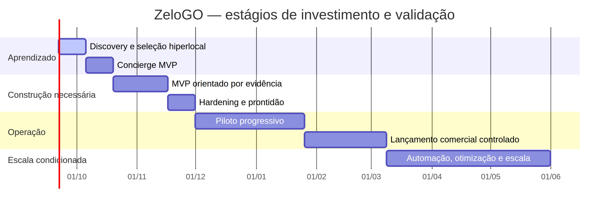

# Plano Macro do Projeto ZeloGO

**Versão:** 1.1  
**Data:** 22 de setembro de 2026  
**Status:** versão consolidada para aprovação executiva  
**Autor:** Manus AI  
**Nome de trabalho:** ZeloGO  
**Horizonte de referência:** 36 semanas  
**Mercado piloto:** Brasília, Distrito Federal, iniciado por uma microrregião hiperlocal a ser selecionada na descoberta  
**Vertical inicial:** lavagem e cuidados automotivos, incluindo validação específica para carros e motocicletas

> **Princípio orientador:** “Antes de comprovar o mercado, investir prioritariamente em aprendizado. Depois de validar a tese, investir em escala.”

## Controle de versão

| Versão | Data | Alteração principal |
|---|---|---|
| 1.0 | 22/09/2026 | Plano macro inicial, com base técnica, governança híbrida e roadmap de 36 semanas. |
| 1.1 | 22/09/2026 | Revisão crítica para transformar o plano em uma estratégia de construção, validação e escala de marketplace. Inclui Concierge MVP, piloto hiperlocal, gates econômicos, monetização antecipada, Trust & Safety, Jurídico Regulatório e Privacidade, árvore de métricas, unit economics e equipe enxuta. |

## 1. Resumo executivo

O **ZeloGO** é um marketplace de dois lados destinado a conectar clientes a estabelecimentos e profissionais de serviços automotivos. A primeira vertical será lavagem e cuidados automotivos. Ela inclui serviços para carros e a validação controlada de serviços para motocicletas. O ZeloGO não é um lava-jato específico. É uma camada de descoberta, confiança, agendamento e relacionamento entre demanda e oferta.

A arquitetura de marca deverá permitir futura expansão para outras categorias de cuidado automotivo. Essa possibilidade não amplia o MVP atual. O projeto começará com uma vertical suficientemente estreita para testar transações reais, mas manterá termos de domínio e estruturas de dados que não bloqueiem evolução posterior.

A aplicação funcional, a API, o banco PostgreSQL, o ambiente público, a localização aproximada e o fluxo inicial de solicitação já reduziram parte importante da incerteza técnica. O maior risco agora não é construir software. É descobrir se existe demanda real, se parceiros podem ser adquiridos e ativados, se uma microrregião terá liquidez, se clientes e parceiros confiarão na operação, se os serviços serão concluídos e se haverá economia unitária que justifique continuar investindo.

O projeto será conduzido em **estágios progressivos de investimento**. As primeiras quatro semanas priorizarão descoberta e um **Concierge MVP**, com intervenção manual controlada. A construção de funcionalidades ocorrerá entre as semanas 5 e 8 somente para hipóteses que tiverem evidência suficiente. O piloto progressivo ocupará aproximadamente as semanas 11 a 18, permitindo observar primeira transação, conclusão, recompra, retorno em 30 dias e retenção de parceiros. Automação, pagamentos e expansão geográfica ficarão condicionados aos gates de mercado, operação, tecnologia e economia.

O resultado esperado ao final das 36 semanas não é apenas um aplicativo concluído. É uma operação local do marketplace com evidências de valor, processo de aquisição e ativação de parceiros, experiência confiável, métricas de liquidez, modelo econômico testado, controles de segurança e condições objetivas para escalar, ajustar, pivotar ou interromper.

## 2. Referencial de gestão e abordagem

A gestão seguirá os princípios atuais do **PMBOK® Guide**, especialmente entrega de valor, adaptação, governança, qualidade, responsabilidade, sustentabilidade e gestão integrada de riscos. O plano preserva a abordagem híbrida. Governança, orçamento, marcos, riscos, conformidade e decisões de investimento são controlados por gates. Descoberta, desenvolvimento e aprendizagem ocorrem em ciclos adaptativos de duas semanas.[1] [2]

A principal adaptação é financeira e epistemológica: o projeto não tratará as 36 semanas como um compromisso único e irreversível. Cada estágio terá uma hipótese, um limite de esforço, uma evidência esperada e uma decisão de continuidade. O volume de recursos comprometidos aumentará somente quando as incertezas relevantes diminuírem.

### 2.1 Regras de execução

1. **Aprendizado antes de automação:** uma operação manual é aceitável quando testa uma transação real, desde que cada intervenção seja registrada.
2. **Transação antes de escala:** uma funcionalidade será priorizada quando aumentar a capacidade de provocar, executar, medir ou proteger uma transação.
3. **Densidade antes de abrangência:** o piloto começará em uma microrregião ou cluster, não na totalidade do Distrito Federal.
4. **Oferta útil antes de cadastro:** parceiro cadastrado não equivale a parceiro disponível, transacionando ou recorrente.
5. **Monetização antes de pagamentos:** disposição para pagar será testada manualmente antes da automação financeira.
6. **Controle sem burocracia:** cada artefato precisa apoiar uma decisão, reduzir um risco, orientar a execução ou produzir aprendizado.
7. **Segurança proporcional e antecipada:** identidade, integridade, privacidade e Trust & Safety não serão postergados por serem menos visíveis ao usuário.

## 3. Termo de abertura do projeto

### 3.1 Problema a validar

Clientes enfrentam dificuldade para encontrar, comparar e agendar serviços automotivos confiáveis em uma região e horário convenientes. Parceiros enfrentam aquisição irregular de clientes, horários ociosos, dependência de mensagens e processos manuais de agenda. O projeto precisa validar se um marketplace consegue reduzir essa fricção de forma melhor do que busca direta, indicação, redes sociais ou o relacionamento atual com clientes recorrentes.

O problema não será considerado validado apenas por entrevistas. A evidência principal deverá incluir transações reais ou tentativas reais de transação: um cliente com necessidade concreta, uma oferta adequada, um parceiro acionado, uma resposta, um atendimento possível e uma avaliação da experiência.

### 3.2 Público inicial

O lado da demanda será formado por proprietários ou usuários de carros e motocicletas que precisam contratar lavagem ou cuidado automotivo com conveniência, previsibilidade e confiança.

O lado da oferta será formado por estabelecimentos fixos, prestadores móveis e operações híbridas que atendem carros, motocicletas ou ambos. O parceiro inicial deve ter capacidade operacional verificável, interesse em receber demanda qualificada e disposição para testar uma agenda publicada ou um fluxo de confirmação.

### 3.3 Proposta de valor a validar

Para o cliente, a hipótese é: **o ZeloGO reduz tempo e incerteza ao mostrar alternativas reais, próximas e disponíveis, com preço, modalidade, confiança e confirmação compreensíveis**.

Para o parceiro, a hipótese é: **o ZeloGO gera demanda qualificada e previsível sem exigir uma operação digital complexa, ajudando a preencher horários e reduzir dependência de aquisição informal**.

A proposta de valor só será considerada fortalecida quando for observada em comportamento, como solicitar um serviço, aceitar um pedido, concluir um atendimento, retornar ou continuar usando a plataforma.

### 3.4 Objetivo geral

Validar e, se houver evidência suficiente, construir e colocar em operação um marketplace hiperlocal de lavagem e cuidados automotivos em Brasília, começando por uma microrregião densa, capaz de conectar clientes e parceiros, provocar serviços concluídos com segurança e demonstrar caminho plausível para recorrência e sustentabilidade econômica.

### 3.5 Objetivos específicos

1. Selecionar uma microrregião com potencial de liquidez antes de ampliar a aquisição de oferta ou demanda.
2. Validar a cadeia demanda → descoberta → disponibilidade → solicitação → aceite → execução → conclusão → satisfação → possibilidade de recorrência.
3. Operar um Concierge MVP entre as semanas 3 e 4 com clientes e parceiros reais.
4. Construir apenas as funcionalidades cuja necessidade seja confirmada pelos experimentos.
5. Validar oferta útil, tempo de resposta, confiança, qualidade e conclusão do serviço.
6. Testar quem paga, por qual benefício, em que momento e com qual impacto sobre aquisição e retenção.
7. Implantar controles de identidade, privacidade, Trust & Safety, auditoria e resolução de conflitos antes do piloto progressivo.
8. Medir a economia unitária sem inventar números e sem projetar LTV antes de haver dados suficientes.
9. Decidir, por gates, se o ZeloGO deve continuar, ajustar, pivotar, repetir o piloto, interromper ou escalar.
10. Encerrar formalmente o projeto e transferir o ZeloGO para produto e operação contínua quando houver condições de transição.

### 3.6 Critérios de sucesso do projeto

O projeto poderá ser considerado bem-sucedido quando houver evidência suficiente para sustentar uma decisão de continuidade, mesmo que a decisão seja ajustar a tese antes de escalar. O sucesso não será definido pelo volume de funcionalidades entregues.

Os critérios de resultado são:

- uma microrregião com oferta e demanda monitoráveis;
- clientes encontrando alternativas viáveis para serviços e períodos desejados;
- parceiros homologados, ativos e respondendo a solicitações;
- serviços reais concluídos com taxa de falha e reclamação controladas;
- satisfação de clientes e parceiros medida após transações;
- evidência de recompra ou retorno em coortes iniciais;
- hipótese de monetização testada sem depender de pagamento online;
- economia unitária calculada a partir de eventos e custos observados;
- controles mínimos de segurança, privacidade, Trust & Safety e suporte;
- decisão executiva de escala, ajuste, repetição, pivot ou interrupção baseada em evidências.

As metas numéricas abaixo são **limiares iniciais de decisão**, não resultados já obtidos. Devem ser aprovadas ou ajustadas no Gate G0:

- pelo menos 15 buscas qualificadas observadas na microrregião;
- pelo menos 8 solicitações reais de serviço;
- pelo menos 5 aceitações de parceiros;
- pelo menos 3 serviços concluídos;
- participação de pelo menos 2 parceiros transacionando;
- taxa de resposta e tempo de confirmação definidos por tipo de parceiro;
- avaliação pós-serviço coletada nos atendimentos concluídos;
- ao menos um sinal de retorno do cliente ou intenção de nova contratação baseada em comportamento;
- ao menos um teste de disposição para pagar com parceiros ou clientes, sem confundir intenção declarada com receita realizada.

Esses limiares devem ser interpretados em conjunto com qualidade da amostra, concentração de esforço manual, sazonalidade e cobertura da microrregião.

### 3.7 Autoridade e tolerâncias

O **patrocinador** aprova objetivos, orçamento, limites de investimento, gates e mudanças de alto impacto. O **gerente do projeto** integra cronograma, riscos, decisões, capacidade e comunicação. O **Product Owner** responde pelo valor, pela ordem do backlog e pela aceitação de incrementos. O **líder de operações do marketplace** responde pela aquisição, homologação, ativação, suporte e qualidade da oferta.

O gerente pode reorganizar trabalho dentro do estágio aprovado. A decisão do patrocinador é necessária para alterar a microrregião, aumentar o investimento de um estágio em mais de 10%, incluir pagamentos online, ampliar o tratamento de dados pessoais, alterar a vertical inicial ou avançar sem evidência mínima de um gate.

## 4. Situação atual e linha de base técnica

A base técnica reduzida já existe e deve ser preservada enquanto permanecer adequada ao estágio do projeto.

| Componente | Situação atual | Uso no próximo estágio |
|---|---|---|
| Repositório | Repositório GitHub do projeto, branch principal versionada | Preservar e registrar a transição de marca sem reescrever o histórico técnico. |
| Aplicação pública | React, Vite e API Node.js publicados na Render | Usar como base de demonstração e experimento controlado. |
| Banco de dados | PostgreSQL gerenciado no Neon | Preservar o padrão PostgreSQL e separar dados demonstrativos de dados de experimento. |
| Descoberta | Geolocalização do navegador e distância aproximada por Haversine | Usar para o Concierge MVP; evoluir somente se a busca for um gargalo comprovado. |
| Modalidades | Atendimento no estabelecimento e no endereço do cliente | Manter, com riscos próprios de Trust & Safety para a modalidade móvel. |
| Agendamento | Solicitação pendente de confirmação do parceiro | Usar como núcleo da transação, com estados e eventos instrumentados. |
| Pagamento | Pagamento diretamente no atendimento | Manter no Concierge e no primeiro piloto, enquanto a disposição para pagar é testada separadamente. |
| Autenticação | Ainda não implementada | Incluir quando for necessária para proteger transações, papéis e dados do piloto. |
| Portal do parceiro | Ainda não implementado | Construir somente o fluxo mínimo confirmado pelos experimentos. |
| Administração | Health check e base técnica, sem backoffice operacional completo | Começar com controles manuais registrados; automatizar após repetição da tarefa. |
| Dados de parceiros | Dados de demonstração | Substituir gradualmente por parceiros homologados e claramente identificados. |
| Observabilidade | Health check básico | Instrumentar eventos e falhas antes de ampliar tráfego. |

React, Node.js, PostgreSQL, Neon, Render e demais decisões atuais não devem ser alterados por preferência. Mudança tecnológica só será recomendada diante de risco relevante, limitação demonstrável, custo incompatível, problema de segurança ou impedimento à evolução prevista.

## 5. Escopo do produto e da validação

### 5.1 Escopo estratégico

O ZeloGO será um marketplace de serviços de cuidado automotivo. A primeira vertical é lavagem e cuidados automotivos. A arquitetura de domínio deve aceitar futuras categorias, como estética, higienização, polimento ou serviços correlatos, mas nenhuma nova categoria será incluída no MVP sem hipótese, parceiro apto e critério de decisão.

### 5.2 Fluxo mínimo de transação

O menor fluxo capaz de testar a tese é:

1. o cliente informa região, modalidade, tipo de veículo e período desejado;
2. encontra ou recebe alternativas reais;
3. escolhe uma opção e solicita o serviço;
4. um parceiro real é acionado;
5. o parceiro aceita ou rejeita;
6. o atendimento ocorre ou é cancelado por motivo registrado;
7. o resultado é marcado como concluído ou não concluído;
8. o cliente avalia a experiência;
9. o parceiro avalia o valor e a qualidade da demanda;
10. a equipe mede esforço manual, tempo, custo e possibilidade de recorrência.

### 5.3 Classificação do escopo por estágio

| Categoria | Conteúdo |
|---|---|
| Indispensável ao Concierge MVP | Cadastro manual de parceiros, seleção de microrregião, catálogo simples, solicitação real, contato com parceiro, aceite ou rejeição, registro do atendimento, avaliação, registro de intervenções e suporte manual. |
| Indispensável ao piloto progressivo | Identidade mínima, autorização por papel, parceiro homologado, oferta e disponibilidade válidas, estados da transação, notificações essenciais, cancelamento, auditoria, privacidade, Trust & Safety e métricas do funil. |
| Necessário ao lançamento comercial | Onboarding repetível, portal mínimo do parceiro, agenda, suporte, moderação, domínio próprio, monitoramento, continuidade, política de qualidade, contratos e modelo de monetização aprovado para teste. |
| Pós-validação | Pagamento online, repasse, automação financeira, PostGIS, rotas, reputação avançada, promoções e analytics aprofundado. |
| Evolução | Aplicativo nativo, precificação dinâmica, fidelidade complexa, publicidade patrocinada, expansão nacional e novas categorias automotivas. |

### 5.4 Fora do investimento inicial

Não serão automatizados antes da validação: dashboards sofisticados, avaliações complexas, recomendação avançada, gestão excessivamente detalhada de veículos, backoffice abrangente, precificação dinâmica, fidelidade, pagamentos online, roteamento avançado, carteira digital, split, franquias ou expansão simultânea na totalidade do Distrito Federal.

Segurança, identidade, integridade de dados, controle de acesso, privacidade, registro de transação e capacidade de recuperar falhas permanecem obrigatórios mesmo no estágio manual.

## 6. Ciclo de vida e forma de trabalho

O ciclo de vida é híbrido, incremental e orientado a evidências. O projeto terá gates executivos e ciclos de duas semanas. Cada ciclo deve resultar em uma transação melhor testada, um risco reduzido, um aprendizado validado ou software potencialmente liberável.

### 6.1 Cadência

- planejamento de estágio no início de cada faixa de investimento;
- planejamento de ciclo a cada duas semanas;
- refinamento semanal de hipóteses, backlog e critérios de aceite;
- reunião operacional curta durante o Concierge e o piloto;
- demonstração quinzenal do que foi aprendido ou entregue;
- retrospectiva quinzenal com ações de melhoria;
- revisão semanal de métricas durante experimentos;
- comitê de gate ao final de cada estágio decisório.

### 6.2 Definição de pronto

Uma entrega está pronta quando possui hipótese ou resultado explícito, critério de aceite, responsável, teste proporcional, registro de dados, documentação mínima, avaliação de segurança e privacidade quando aplicável, plano de reversão para mudanças técnicas e decisão do Product Owner. No Concierge MVP, uma operação manual também exige roteiro, log de intervenção, responsável e forma de medir seu custo.

## 7. Estratégia de mercado piloto hiperlocal

Brasília é o mercado piloto macro. O projeto não tentará obter liquidez na totalidade do Distrito Federal simultaneamente. A primeira operação será iniciada em uma microrregião ou cluster pequeno, selecionado até o final da Semana 2.

### 7.1 Critérios de seleção da microrregião

A escolha deve considerar:

- densidade potencial de clientes e parceiros;
- facilidade de deslocamento e cobertura móvel;
- concentração de estabelecimentos e horários disponíveis;
- compatibilidade entre demanda, preço e capacidade;
- segurança operacional para atendimentos no endereço;
- disponibilidade de parceiros-design para o Concierge;
- facilidade de acompanhar pessoalmente os primeiros atendimentos;
- possibilidade de repetir o modelo em outro cluster.

O plano não afirma que uma microrregião específica já foi validada. O nome da microrregião será uma decisão do Gate G0 baseada em evidências de oferta e demanda, e não em preferência territorial.

### 7.2 Estados do parceiro

O projeto deverá diferenciar os seguintes estados:

| Estado | Definição |
|---|---|
| Cadastrado | Informou dados básicos, sem validação completa. |
| Homologado | Teve identidade comercial, capacidade, serviço e condições mínimas verificadas. |
| Ativado | Está apto e orientado para receber demanda no fluxo do ZeloGO. |
| Disponível | Publicou serviço, modalidade, região e horário utilizáveis. |
| Transacionando | Recebeu e respondeu a uma solicitação real. |
| Recorrente | Continua ativo e realiza novas transações em períodos subsequentes. |

O número de cadastrados será informativo. O sucesso de oferta será medido por parceiros homologados, ativados, disponíveis, transacionando e recorrentes.

### 7.3 Indicadores de liquidez

Uma busca qualificada é aquela que informa tipo de serviço, modalidade, microrregião e período ou janela de atendimento suficientemente definidos para verificar oferta.

O indicador central de liquidez será:

> **Taxa de alternativas viáveis:** percentual de buscas qualificadas nas quais o cliente encontra pelo menos três alternativas viáveis para o serviço, região e período desejados.

A fórmula é:

`buscas qualificadas com três ou mais alternativas viáveis / total de buscas qualificadas`

Também serão acompanhados:

- parceiros homologados por microrregião;
- parceiros ativados e disponíveis;
- horários úteis publicados;
- cobertura por serviço, modalidade e período;
- taxa de resposta;
- tempo mediano e p90 até confirmação;
- relação entre oferta disponível e demanda qualificada;
- taxa de preenchimento dos horários publicados;
- pedidos sem alternativa adequada;
- pedidos rejeitados por falta de capacidade;
- concentração da demanda em poucos parceiros.

## 8. Concierge MVP

### 8.1 Objetivo

Entre as semanas 3 e 4, o Concierge MVP deverá testar transações reais antes da automação integral. Parte da operação poderá ocorrer por planilha, telefone, WhatsApp ou ação manual no backoffice, desde que o cliente receba uma experiência identificável, o parceiro seja real e cada intervenção seja registrada.

O Concierge não é uma simulação. Seu resultado precisa revelar se o marketplace consegue produzir valor com esforço manual conhecido e se a automação posterior resolverá uma dor comprovada.

### 8.2 Escopo operacional

A equipe deverá:

1. recrutar parceiros-design dentro da microrregião escolhida;
2. homologar oferta, preço, duração, modalidade e disponibilidade;
3. captar clientes com necessidades reais, sem prometer disponibilidade que não exista;
4. apresentar alternativas viáveis;
5. registrar solicitação, canal, horário e responsável;
6. acionar o parceiro e registrar aceite, rejeição ou ausência de resposta;
7. acompanhar o atendimento até conclusão, cancelamento ou falha;
8. coletar avaliação do cliente e percepção de valor do parceiro;
9. registrar o esforço manual e o custo aproximado por transação;
10. documentar situações de risco, reclamação e exceção.

### 8.3 Evidências mínimas do Gate G1

O Gate G1 responderá: **“Conseguimos provocar transações reais e gerar valor para clientes e parceiros antes de automatizar integralmente o marketplace?”**

A recomendação de avanço exigirá, como limiar inicial a ser aprovado no G0:

- buscas qualificadas em uma mesma microrregião;
- solicitações de clientes com necessidade concreta;
- parceiros reais respondendo a pedidos;
- serviços efetivamente concluídos;
- avaliação do cliente após o serviço;
- avaliação do parceiro sobre a qualidade do cliente gerado;
- registro de cada tempo e intervenção manual;
- ausência de incidente crítico não tratado;
- pelo menos um aprendizado que altere a prioridade de produto;
- uma decisão explícita sobre o que deve ser automatizado e o que deve continuar manual.

O Gate G1 poderá decidir: construir o MVP mínimo, ajustar a proposta, repetir o Concierge, mudar a microrregião, mudar o segmento, pivotar ou interromper.

## 9. Monetização e unit economics

### 9.1 Validação da monetização versus automação financeira

A disposição para pagar será testada antes da implementação de pagamento online, carteira, split ou repasse automatizado. O projeto distinguirá:

- **validação do modelo de monetização:** descobrir quem paga, por quê, quanto, quando e com que efeito sobre comportamento;
- **automação financeira:** construir cobrança, pagamento, conciliação, estorno, fraude e repasse.

O segundo item só será iniciado quando o primeiro tiver evidência suficiente e quando o custo de manualidade superar o risco operacional aceitável.

### 9.2 Experimentos comerciais

Durante discovery, Concierge e piloto, poderão ser testados manualmente:

- assinatura mensal do parceiro;
- tarifa por agendamento confirmado;
- tarifa por serviço concluído;
- cobrança por lead qualificado;
- comissão sobre a transação;
- benefício pago pelo cliente, caso a pesquisa mostre disposição e impacto aceitável;
- modelos híbridos identificados nas entrevistas.

Cada experimento deverá registrar quem paga, qual evento dispara a cobrança, benefício prometido, valor apresentado, objeção, conversão, efeito sobre ativação e possibilidade de repetição. Não haverá cobrança real sem informação adequada, consentimento e revisão contratual aplicável.

### 9.3 Unit economics

As métricas serão introduzidas progressivamente:

| Métrica | Fórmula ou definição | Quando medir |
|---|---|---|
| CAC de cliente | custo incremental de aquisição / clientes ativados | Assim que houver canal pago ou custo de campanha mensurável |
| CAC de parceiro | custo de aquisição e ativação / parceiros ativados | Desde a prospecção do Concierge |
| Custo de ativação | pessoas, materiais, treinamento e suporte para ativar um parceiro | Desde o primeiro parceiro-design |
| Receita por transação | receita reconhecida por serviço concluído | Quando houver experimento de monetização |
| Take rate | receita da plataforma / valor transacionado | Somente quando houver comissão ou tarifa proporcional |
| Custo variável | custos incrementais de mensagens, mapas, suporte, incentivos e operação | Desde a primeira transação |
| Margem de contribuição | receita por transação − custos variáveis | Quando houver receita e custos observados |
| Taxa de recompra | clientes com nova transação / clientes atendidos | Após janela de observação suficiente |
| Retenção de parceiros | parceiros transacionando novamente / parceiros transacionando | Por coorte de ativação |
| Payback | CAC / margem de contribuição média por período | Após dados de repetição |
| LTV | valor presente de margem ao longo da relação | Somente quando houver coortes e dados suficientes |

Sem dados observados, o plano registrará fórmula, evento necessário, fonte, início de medição e hipótese. Não serão produzidos números fictícios.

## 10. Cronograma como estágios de investimento

As 36 semanas são horizonte de referência e roadmap. Cada faixa abaixo é uma autorização condicional de esforço. A aprovação de uma faixa não obriga o patrocínio a financiar a seguinte.

| Período | Estágio | Objetivo | Investimento principal | Gate |
|---|---|---|---|---|
| Semanas 1–2 | Discovery e seleção hiperlocal | Validar problema, segmentos, microrregião, parceiros-design, hipóteses e métricas | Pesquisa, entrevistas, prospecção e operação | G0: foco e experimento autorizados |
| Semanas 3–4 | Concierge MVP | Provocar transações reais com operação manual controlada | Aquisição, atendimento, registro e aprendizado | G1: transação real gera valor |
| Semanas 5–8 | Construção orientada por evidência | Automatizar somente gargalos comprovados | Identidade mínima, oferta, disponibilidade, estados e eventos | G2: MVP mínimo justificado |
| Semanas 9–10 | Hardening e prontidão | Tornar o fluxo seguro, observável e treinável | Testes, LGPD, Trust & Safety, continuidade e suporte | G3: piloto progressivo seguro |
| Semanas 11–18 | Piloto progressivo | Validar operação, confiança, conclusão, retorno e parceiros | Expansão controlada, coortes, suporte e experimentos comerciais | G4 na Semana 16; G5 no encerramento do piloto |
| Semanas 19–24 | Lançamento comercial controlado | Aumentar demanda sem perder qualidade e medir monetização | Aquisição, suporte, domínio, infraestrutura e processos | G6: operação comercial controlada |
| Semanas 25–36 | Automação, otimização e escala | Automatizar tarefas comprovadas e preparar replicação | Pagamentos se justificados, analytics, eficiência e novos clusters | G7 e G8 |

*Figura 1 — Estágios de investimento e validação. As datas são indicativas e dependem dos gates.*

As datas do diagrama são indicativas. O Gate G0 poderá ajustar a data de início do Concierge sem invalidar a lógica de estágios.

## 11. Etapas e resultados esperados

### 11.1 Etapa 1 — Discovery e seleção hiperlocal, Semanas 1–2

A equipe realizará entrevistas com clientes e parceiros, analisará alternativas atuais, mapeará oferta por microrregião e selecionará parceiros-design. A pesquisa deve incluir carros e motocicletas, sem transformar a vertical inicial em um marketplace genérico.

**Entregas:** problema e segmentos priorizados, proposta de valor para os dois lados, microrregião recomendada, mapa de parceiros, hipóteses priorizadas, métricas, riscos, roteiro do Concierge, critérios do G0 e backlog de experimentos.

**Resultado esperado:** uma tese pequena e testável. O G0 não pergunta se o software está completo. Pergunta se há foco territorial, acesso a participantes e uma cadeia transacional que pode ser observada.

### 11.2 Etapa 2 — Concierge MVP, Semanas 3–4

A equipe realizará transações reais com intervenção manual. O produto atual poderá ser complementado por planilha, contato assistido ou backoffice temporário. Nenhuma intervenção será escondida em relatórios.

**Entregas:** log de buscas, solicitações, respostas, conclusões, avaliações, incidentes, intervenções, tempo operacional e percepção de valor do parceiro.

**Resultado esperado:** evidência de demanda e oferta em uma microrregião. O G1 define se vale construir, o que automatizar e quais premissas foram descartadas.

### 11.3 Etapa 3 — Construção orientada por evidência, Semanas 5–8

Somente gargalos observados no Concierge serão automatizados. O primeiro incremento provável inclui identidade mínima, papéis, parceiro homologado, serviço, disponibilidade, solicitação, resposta, conclusão e eventos do funil. A solução não deverá acumular funções porque estavam no plano original.

**Resultado esperado:** o fluxo transacional básico executa com menos intervenção, mantendo a capacidade de auditoria. O G2 avalia se cada funcionalidade entregue tem relação com evidência de mercado, operação ou segurança.

### 11.4 Etapa 4 — Hardening e prontidão, Semanas 9–10

A equipe executará testes funcionais, concorrência de agenda, autorização, recuperação, acessibilidade, observabilidade, segurança e privacidade. Também definirá rotinas de suporte, incidentes, reclamações, bloqueio de parceiros e restauração.

**Resultado esperado:** uma versão capaz de operar o piloto progressivo sem depender de conhecimento informal de uma única pessoa. O G3 aprova ou rejeita a entrada em piloto.

### 11.5 Etapa 5 — Piloto progressivo, Semanas 11–18

O piloto terá oito semanas para observar primeira transação, conclusão, recompra, retorno em 30 dias, coortes iniciais, retenção de parceiros e evolução da oferta. A entrada de clientes será graduada. O Gate G4, por volta da Semana 16, será uma decisão econômica e estratégica intermediária. O G5 encerrará formalmente a janela do piloto.

**Resultado esperado:** evidência sobre liquidez, confiança, velocidade, qualidade, recorrência, retenção e custos. A decisão poderá ser continuar, ajustar, pivotar, repetir o piloto ou interromper.

### 11.6 Etapa 6 — Lançamento comercial controlado, Semanas 19–24

O lançamento será limitado à microrregião ou a um segundo cluster somente se a primeira operação demonstrar capacidade. Serão formalizados suporte, onboarding, contratos, políticas, processo de qualidade, modelo de monetização e limites de aquisição.

**Resultado esperado:** demanda comercial crescente sem queda não explicada em confirmação, conclusão, satisfação ou confiança. O G6 decidirá se a operação comercial está sob controle.

### 11.7 Etapa 7 — Automação, otimização e escala, Semanas 25–36

A equipe automatizará tarefas com volume, custo ou risco comprovados. Pagamentos online só entrarão se a monetização e a necessidade operacional forem validadas. Rotas, PostGIS, reputação, promoções e analytics avançado serão tratados como investimentos condicionais.

**Resultado esperado:** maior eficiência operacional, economia unitária mais clara e procedimento replicável. O G7 decide se existe base para outro cluster. O G8 encerra o projeto e transfere o produto para operação contínua.

## 12. Backlog por capacidade

| Capacidade | Concierge MVP | Piloto | Lançamento | Evolução |
|---|---|---|---|---|
| Identidade | Registro mínimo e identificação do parceiro | Autenticação e papéis | Sessões, recuperação e controles de acesso | Autenticação reforçada |
| Cliente | Necessidade, região, veículo e contato mínimo | Perfil, histórico e cancelamento | Preferências, suporte e consentimentos | Fidelidade, se validada |
| Parceiro | Cadastro manual, homologação e oferta | Onboarding e disponibilidade | Portal mínimo, equipe e indicadores | Unidades, precificação e promoções |
| Agendamento | Solicitação e resposta manual | Estados, confirmação, rejeição e conclusão | Lembretes, regras e reagendamento | Automação avançada |
| Descoberta | Alternativas assistidas e busca aproximada | Filtros e disponibilidade por microrregião | Liquidez por serviço e período | PostGIS, rotas e recomendação |
| Comunicação | Telefone, WhatsApp ou canal manual registrado | Notificações essenciais | Central de notificações | Campanhas segmentadas |
| Administração | Planilha e log controlado | Painel mínimo, suporte e auditoria | Moderação e relatórios | Automação antifraude |
| Trust & Safety | Homologação, regras e canal de reclamação | Evidências, bloqueio e disputa | SLA, incidentes e seguros avaliados | Detecção de fraude |
| Monetização | Entrevistas e testes comerciais manuais | Experimentos de cobrança | Modelo aprovado e mensurável | Pagamento online, se justificado |
| Dados | Registro de eventos críticos | Funil, coortes e custos | Unit economics e operação | Experimentação e previsão |

## 13. Trust & Safety — Confiança e segurança

Trust & Safety é uma capability própria do ZeloGO, não um subconjunto informal de suporte. Ela deve proteger cliente, parceiro e plataforma, especialmente quando houver atendimento no endereço do cliente.

### 13.1 Riscos a mapear

- identidade e homologação do prestador;
- autenticidade de dados comerciais;
- acesso a residências, condomínios e garagens;
- danos ao veículo e objetos deixados no interior;
- registro fotográfico antes e depois, quando adequado e consentido;
- falsos atendimentos, pedidos fraudulentos e no-show;
- avaliações abusivas, manipuladas ou retaliatórias;
- comportamento inadequado, assédio ou discriminação;
- reclamações, disputas e reembolso;
- uso de água, energia e infraestrutura no atendimento móvel;
- capacidade técnica e requisitos mínimos do serviço;
- seguros ou evidências de cobertura, quando aplicável;
- segurança física de clientes e prestadores.

### 13.2 Camadas de controle

| Camada | Responsabilidade |
|---|---|
| Plataforma | Identidade, acesso, logs, estados, notificações, proteção de dados e integridade da reserva. |
| Operação | Homologação, treinamento, suporte, análise de reclamações, advertência e suspensão. |
| Parceiro | Informação verdadeira, execução conforme oferta, cuidado com veículo, comportamento e resposta a incidentes. |
| Cliente | Informações corretas, acesso seguro, respeito ao parceiro e comunicação de danos ou problemas. |

Antes do piloto progressivo, deverão existir critérios de advertência, bloqueio, suspensão, investigação, reativação e comunicação. A plataforma não deve prometer responsabilidade que ainda não foi avaliada juridicamente ou operacionalmente.

## 14. Jurídico, Regulatório e Privacidade

A frente jurídica será ampliada de “privacidade” para **Jurídico, Regulatório e Privacidade**. O plano não antecipa conclusões jurídicas sem análise suficiente. Cada tema será registrado como requisito, hipótese ou questão a validar.

A análise deverá considerar:

- relações de consumo;
- papel jurídico da plataforma;
- responsabilidade por danos ao veículo;
- contratos e termos dos parceiros;
- documentação fiscal;
- modelo tributário;
- prestadores pessoas físicas ou jurídicas;
- regras locais para prestação móvel;
- requisitos ambientais eventualmente aplicáveis;
- uso de água e descarte;
- seguros;
- cancelamento, reembolso e não comparecimento;
- resolução de conflitos;
- bases legais, minimização, retenção e direitos dos titulares na LGPD.[3]

O projeto deverá mapear controlador, operadores e compartilhamentos de dados, além de definir finalidade, acesso, retenção, exclusão, resposta a incidentes e canal para solicitações dos titulares. A localização do cliente, endereço de atendimento, telefone e dados do veículo receberão proteção proporcional ao risco.

## 15. Árvore de métricas e North Star Metric

A **North Star Metric** será mantida como:

> **Serviços concluídos com sucesso por semana.**

Ela é preferida porque exige que oferta, descoberta, solicitação, confirmação, execução e qualidade funcionem em conjunto. A árvore causal deverá ser lida da esquerda para a direita, sempre perguntando como a métrica influencia serviços concluídos.

| Nível causal | Indicadores principais | Relação com a North Star |
|---|---|---|
| Oferta | Parceiros homologados, ativados, disponíveis e recorrentes | Sem oferta útil não há serviço para concluir. |
| Liquidez | Taxa de três alternativas viáveis, cobertura por microrregião e horários úteis | Liquidez aumenta a chance de o cliente encontrar uma opção adequada. |
| Aquisição | Clientes qualificados, CAC, origem e custo de ativação | Aquisição coloca demanda real no funil. |
| Ativação | Primeiro pedido, primeiro parceiro transacionando e primeira oferta publicada | Ativação transforma cadastro em capacidade de participar. |
| Conversão | Busca → solicitação → aceite → agendamento | Conversão reduz perda antes do atendimento. |
| Velocidade | Tempo de resposta, mediana e p90 até confirmação | Resposta rápida reduz abandono e aumenta previsibilidade. |
| Confiabilidade | Cancelamento, rejeição, no-show, falha e disputa | Confiabilidade protege a conclusão e a confiança. |
| Qualidade | Avaliação, reclamação, retrabalho e resolução | Qualidade sustenta satisfação e retorno. |
| Retenção | Recompra, retorno em 30 dias, coortes e retenção de parceiros | Retenção transforma transação isolada em relação recorrente. |
| Economia unitária | Receita, custo variável, margem, CAC, payback e incentivos | Economia define se serviços concluídos podem crescer de forma sustentável. |

Downloads, visitas, contas criadas e parceiros cadastrados podem ser acompanhados, mas não serão o principal critério de sucesso.

## 16. Gestão das partes interessadas e responsabilidades

| Parte interessada | Interesse | Estratégia |
|---|---|---|
| Patrocinador | Valor, risco, investimento e decisões de continuidade | Comitês de gate e relatório executivo. |
| Clientes | Conveniência, preço, confiança e previsibilidade | Entrevistas, transações assistidas e avaliações. |
| Parceiros | Demanda, agenda, simplicidade e retorno | Cocriação, Concierge, onboarding e acompanhamento. |
| Operação | Capacidade de executar e resolver exceções | Rotinas, runbooks, treinamento e indicadores. |
| Tecnologia | Qualidade, segurança, dados e sustentabilidade | Ciclos de duas semanas e revisão técnica. |
| Trust & Safety | Confiança e tratamento de incidentes | Participação desde Concierge e piloto. |
| Jurídico, Regulatório e Privacidade | Exposição legal, dados e contratos | Revisão por estágio e gates de liberação. |
| Aquisição e marketing | Custo e qualidade da demanda | Experimentos com métricas de conversão. |
| Provedores | Disponibilidade, limites, custo e portabilidade | Revisão contratual e contingência. |

### 16.1 RACI resumido

R significa responsável pela execução, A autoridade final, C consultado e I informado.

| Entrega ou decisão | Patrocinador | Gerente | Produto | Tecnologia | Operações | Trust & Safety | Jurídico/Privacidade |
|---|---|---|---|---|---|---|---|
| Termo, orçamento e estágio | A | R | C | I | C | C | C |
| Discovery e hipóteses | I | R | A | C | R | C | C |
| Seleção da microrregião | A | R | R | I | R | C | I |
| Concierge MVP | I | A | R | C | R | R | C |
| Backlog e arquitetura | I | C | A | R | C | C | C |
| Regras operacionais | I | C | C | C | A/R | R | C |
| Privacidade e contratos | I | C | C | C | C | C | A/R |
| Gate de mercado e economia | A | R | C | C | C | C | C |
| Incidente crítico | I | A | I | R | R | R | C |
| Decisão de escala | A | R | C | C | C | C | C |

## 17. Gestão do cronograma e dos estágios

Cada estágio terá uma linha de base de objetivos, capacidade e limite de investimento. O backlog do estágio seguinte não será detalhado como compromisso antes do gate correspondente.

Um atraso em uma tarefa não é automaticamente um problema de projeto se o aprendizado continuar dentro do limite aprovado. Já uma construção sem evidência é um desvio mesmo quando entregue no prazo.

A variação relevante será medida em quatro dimensões: evidência de mercado, capacidade operacional, qualidade técnica e economia. Um estágio será replanejado quando a evidência não puder ser obtida, quando a operação estiver mascarando falhas ou quando o custo de aprendizado deixar de ser proporcional ao valor da decisão.

## 18. Equipe e capacidade progressiva

O projeto será iniciado com uma equipe enxuta, adequada ao estágio pré-product-market fit. A configuração final dependerá das entregas e dos gates, não de uma estrutura fixa mantida por inércia.

### 18.1 Núcleo inicial

- liderança de produto e negócio;
- engenharia;
- produto/UX, em dedicação parcial ou compartilhada;
- operação de marketplace.

Apoio sob demanda ou parcial:

- Jurídico, Regulatório e Privacidade;
- Trust & Safety;
- segurança;
- DevOps;
- qualidade;
- marketing e performance;
- análise financeira.

### 18.2 Envelope de capacidade

| Estágio | Capacidade indicativa | Envelope de pessoa-mês | Regra de expansão |
|---|---|---:|---|
| Semanas 1–4 | Núcleo de quatro funções e apoio pontual | 4,5–6 | Não expandir por expectativa; expandir se houver acesso a experimentos e decisão clara. |
| Semanas 5–8 | Núcleo mais engenharia ou qualidade conforme gargalo | 5–7 | Contratar ou alocar apenas para gargalos confirmados. |
| Semanas 9–10 | Tecnologia, qualidade, segurança, operações e jurídico concentrados | 2,5–4 | Liberar trabalho de hardening conforme risco real. |
| Semanas 11–18 | Núcleo, operação, suporte e apoio analítico | 8–12 | Aumentar suporte somente conforme volume e qualidade. |
| Semanas 19–24 | Produto, engenharia, operação, aquisição e suporte | 8–12 | Escalar demanda apenas se a oferta e o suporte suportarem. |
| Semanas 25–36 | Capacidade adicional condicionada a economia e replicabilidade | 15–22 | Expandir equipe depois do G6/G7, não antes. |

O envelope aproximado de 43 a 63 pessoa-mês é uma faixa de planejamento, não orçamento aprovado nem compromisso de contratação. O orçamento deve ser derivado de custos reais, fornecedores, capacidade e decisões de gate. Uma reserva de contingência entre 10% e 15% pode ser considerada sobre o orçamento controlável, depois de definidos os custos.

## 19. Qualidade, segurança e continuidade

A qualidade será incorporada ao trabalho e avaliada em quatro dimensões: experiência, correção, confiabilidade e segurança. No Concierge, qualidade também significa não esconder o custo da manualidade.

| Dimensão | Controle | Critério de decisão |
|---|---|---|
| Experiência | Entrevistas, transações observadas e tarefas críticas | O cliente entende oferta, preço, horário e próximo passo. |
| Funcional | Testes unitários, integração, API e aceite | Nenhum defeito crítico no fluxo transacional. |
| Operação | Log de intervenção, runbook e suporte | A equipe consegue executar e resolver sem depender de memória individual. |
| Desempenho | Latência e carga quando houver volume | Gargalo técnico medido antes de investir em otimização. |
| Disponibilidade | Health checks, alertas e incidentes | Meta ajustada ao estágio e ao plano contratado. |
| Segurança | Autorização, segredos, dependências e acessos | Nenhuma vulnerabilidade crítica conhecida e nenhum segredo no repositório. |
| Privacidade | Inventário, finalidade, retenção e direitos | Tratamento adequado à finalidade antes do uso real. |
| Integridade | Idempotência, transações e testes de concorrência | Nenhuma dupla reserva conhecida no fluxo aprovado. |
| Continuidade | Backup, restauração, rollback e contatos | Restauração testada antes de ampliar a operação. |

O desenvolvimento continuará local e o banco permanecerá na nuvem enquanto isso for adequado. Neon e Render continuam adequados ao protótipo e ao estágio inicial, mas os limites dos planos gratuitos devem ser tratados como risco de continuidade, não como garantia de produção comercial.[4] [5]

## 20. Gestão de riscos

| ID | Risco | Probabilidade | Impacto | Resposta | Proprietário |
|---|---|---:|---:|---|---|
| R1 | Demanda insuficiente na microrregião | Alta | Alto | Testar buscas e solicitações antes da construção ampla | Produto |
| R2 | Oferta insuficiente ou dispersa | Alta | Alto | Selecionar cluster por densidade e ativar parceiros-design | Operações |
| R3 | Parceiros não respondem | Alta | Alto | SLA, alerta, expiração e desenho de incentivo | Produto/Operações |
| R4 | Oferta publicada não é realmente utilizável | Alta | Alto | Diferenciar disponível, transacionando e recorrente | Operações |
| R5 | Cliente não encontra três alternativas viáveis | Alta | Alto | Reduzir cluster, ajustar catálogo ou recrutar oferta específica | Produto |
| R6 | Falta de confiança no parceiro | Alta | Alto | Homologação, provas de qualidade, avaliações e suporte | Trust & Safety |
| R7 | Cancelamentos, no-show ou retrabalho | Alta | Alto | Regras, lembretes, motivos e tratamento de exceções | Operações |
| R8 | Dano ao veículo ou objeto do cliente | Média | Alto | Termos, evidência proporcional, investigação e avaliação de seguro | Trust & Safety/Jurídico |
| R9 | Acesso inseguro a residência ou condomínio | Média | Alto | Limitar modalidade, orientar partes e definir incidentes | Trust & Safety |
| R10 | Fraude, falso atendimento ou avaliação abusiva | Média | Alto | Auditoria, padrões de anomalia, moderação e suspensão | Trust & Safety |
| R11 | Coleta excessiva de endereço ou localização | Média | Alto | Minimização, finalidade, acesso e retenção | Privacidade |
| R12 | Relações de consumo e responsabilidade mal definidas | Média | Alto | Análise jurídica e contratos antes do piloto aberto | Jurídico |
| R13 | Uso de água, descarte ou regra local não avaliado | Média | Alto | Registrar questão regulatória e validar por modalidade | Jurídico/Operações |
| R14 | Monetização reduz ativação de parceiros | Média | Alto | Testar modelos manualmente e medir comportamento | Negócio |
| R15 | Economia unitária inviável | Alta | Alto | Medir custos por transação e gate econômico na Semana 16 | Finanças/Produto |
| R16 | Escopo cresce antes do product-market fit | Alta | Médio | Gates, backlog por hipótese e controle de mudanças | Gerente |
| R17 | Instabilidade dos planos gratuitos | Alta | Médio | Monitorar, definir gatilhos e prever migração | Tecnologia |
| R18 | Dupla reserva ou inconsistência de estado | Média | Alto | Transação, idempotência e testes concorrentes | Tecnologia |
| R19 | Incapacidade de medir intervenção manual | Média | Alto | Log obrigatório de canal, tempo e responsável | Gerente/Operações |
| R20 | Recorrência não observada na janela do piloto | Média | Alto | Piloto de seis a oito semanas e análise por coortes | Produto |
| R21 | Expansão geográfica prematura | Média | Alto | Critérios de replicabilidade e G7 | Patrocinador |
| R22 | Conta privilegiada comprometida | Baixa | Alto | MFA, menor privilégio, logs e rotação | Segurança |

Riscos altos serão revisados semanalmente durante o Concierge e o piloto e em cada gate. Um risco não será considerado encerrado apenas por deixar de aparecer no status.

## 21. Aquisições e fornecedores

Os fornecedores potenciais são hospedagem, banco de dados, domínio, mapas e geocodificação, comunicação transacional, monitoramento, pesquisa e futuro provedor de pagamentos. Cada decisão deverá considerar custo total, disponibilidade, limites, portabilidade, segurança, localização de dados, suporte, saída e impacto sobre o estágio de investimento.

A arquitetura atual com React, Node.js, PostgreSQL, Neon e Render permanece adequada ao protótipo. Antes do lançamento comercial, deverão ser revisados suspensão por inatividade, backups, região, logs, limites, disponibilidade e custo. A contratação de mensagens ou pagamentos dependerá de volume, necessidade observada e aprovação do gate.

## 22. Comunicação e reporte

| Comunicação | Público | Frequência | Conteúdo | Responsável |
|---|---|---:|---|---|
| Status executivo | Patrocinador e comitê | Quinzenal | Evidência, investimento, risco e decisão | Gerente |
| Diário de Concierge | Produto e operações | Diário | Buscas, pedidos, respostas, conclusão e intervenção | Operações |
| Demonstração | Partes interessadas | Quinzenal | Transações, aprendizado e incremento | Product Owner |
| Painel do piloto | Produto, operação e Trust & Safety | Diário | Oferta, liquidez, funil, qualidade e incidentes | Operações |
| Relatório de coorte | Comitê | Semanal | Primeira transação, retorno e retenção | Produto/Análise |
| Revisão de riscos | Líderes | Semanal no piloto; quinzenal fora dele | Exposição, resposta e escalonamento | Gerente |
| Incidente crítico | Partes afetadas | Conforme severidade | Impacto, contenção, recuperação e ação corretiva | Líder do incidente |

O relatório executivo deverá responder a cinco perguntas: o que aprendemos, o que mudou, quanto investimos, qual risco aumentou e qual decisão é necessária.

## 23. Controle integrado de mudanças

Mudanças de backlog que não alterem gate, orçamento, dados ou objetivo podem ser decididas pelo Product Owner. Mudanças que alterem a hipótese principal, a microrregião, o estágio, a vertical, a monetização, o tratamento de dados ou a responsabilidade jurídica exigem análise do gerente e decisão do patrocinador.

Toda mudança deverá registrar problema, hipótese afetada, benefício esperado, alternativas, esforço, risco, evidência necessária e condição de reversão. O controle de mudanças não servirá para proteger funcionalidades planejadas contra aprendizado contrário.

## 24. Gates e critérios de decisão

Cada gate responde uma pergunta gerencial ou econômica. A avaliação deve considerar evidência de **mercado, operação, tecnologia e economia**. Os gates não são checklists burocráticos nem gates exclusivamente de entrega de software.

| Gate | Semana | Pergunta | Evidência mínima |
|---|---:|---|---|
| G0 | 2 | Temos foco, participantes e uma microrregião adequados para testar? | Mercado: problema e segmentos; Operação: parceiros-design; Tecnologia: fluxo demonstrável; Economia: limite de esforço e eventos de custo. |
| G1 | 4 | Conseguimos provocar transações reais e gerar valor antes da automação integral? | Mercado: solicitações reais; Operação: aceite e conclusão; Tecnologia: registro e integridade; Economia: esforço manual e sinal de valor. |
| G2 | 8 | As evidências justificam construir e quais funcionalidades são indispensáveis? | Mercado: problema e fluxo fortalecidos; Operação: gargalos conhecidos; Tecnologia: MVP mínimo; Economia: hipótese de monetização e custo de intervenção. |
| G3 | 10 | O fluxo está seguro e observável para um piloto progressivo? | Mercado: proposta compreensível; Operação: suporte e runbook; Tecnologia: testes, segurança e recuperação; Economia: instrumentação e limites. |
| G4 | 16 | O piloto mostra caminho plausível de liquidez, qualidade e economia? | Mercado: coortes e retorno inicial; Operação: oferta, resposta e conclusão; Tecnologia: estabilidade; Economia: custos, receita experimental e decisão de continuar ou ajustar. |
| G5 | 18 | A janela completa do piloto justifica lançamento controlado? | Mercado: satisfação e recorrência; Operação: parceiros retidos; Tecnologia: falhas tratadas; Economia: unit economics inicial e plano de monetização. |
| G6 | 24 | A operação comercial controlada consegue crescer sem degradar confiança? | Mercado: aquisição e conversão; Operação: suporte e cobertura; Tecnologia: disponibilidade e capacidade; Economia: custo de aquisição e margem observável. |
| G7 | 32 | A automação e a expansão geográfica são justificadas? | Mercado: retenção; Operação: replicabilidade; Tecnologia: gargalos comprovados; Economia: payback ou caminho plausível. |
| G8 | 36 | O projeto pode ser encerrado e transferido para produto e operação? | Mercado: benefícios e próximos riscos; Operação: responsáveis e runbooks; Tecnologia: ativos e continuidade; Economia: orçamento e metas da operação. |

Decisões possíveis em G1, G4 e G5 incluem **continuar, ajustar, pivotar, repetir o experimento, reduzir escopo ou interromper**. O projeto não avançará apenas porque tarefas foram concluídas.

## 25. Ambientes, implantação e dados

O projeto manterá ambientes de desenvolvimento local, homologação e produção. A produção conterá somente dados reais autorizados. Dados demonstrativos serão rotulados e isolados de qualquer comunicação comercial.

Migrações continuarão versionadas. Cada implantação deverá ter health check, verificação de banco, logs, rollback e responsável. Nenhuma credencial será versionada. A hospedagem atual permanecerá adequada para demonstração e experimentação inicial, mas plano sem suspensão, domínio próprio, monitoramento e revisão de região deverão ser considerados antes do lançamento comercial.[4]

## 26. Plano de realização de benefícios

A realização de benefícios começa antes do encerramento do projeto. A equipe acompanhará os indicadores por três meses após a transição, salvo decisão diferente do patrocinador.

Os benefícios esperados são:

- menor tempo para descobrir opções úteis;
- mais previsibilidade na confirmação e execução;
- melhor utilização de horários disponíveis dos parceiros;
- redução de dependência de aquisição informal;
- aprendizado mensurável sobre demanda, confiança e recorrência;
- caminho plausível para uma operação economicamente sustentável;
- capacidade de replicar a operação em outra microrregião.

Cada benefício deverá ter indicador, fonte, proprietário, frequência e condição de não realização. Benefício declarado sem mecanismo de medição não será usado para justificar escala.

## 27. Projeto, produto e operação contínua

O encerramento formal do projeto não encerra o ZeloGO. A transição obedecerá ao fluxo:

> **Projeto → Produto → Operação contínua**

Durante o projeto, o gerente coordena escopo, prazo, risco, orçamento, gates e aceite. Após o encerramento, o Product Owner e a operação assumem backlog, métricas, suporte, incidentes, qualidade, Trust & Safety, fornecedores e evolução.

Deixam de existir com o encerramento do projeto: comitê temporário de gates, linha de base do projeto, relatório de encerramento e controle de mudanças específico do projeto. Permanecem na gestão do produto: revisão de métricas, roadmap, backlog, segurança, privacidade, continuidade, auditoria, incidentes, revisão de parceiros, monetização e decisão de expansão.

A transição exige runbooks, contatos, acessos, contratos, modelo de dados, procedimentos de restauração, riscos residuais aceitos, backlog remanescente e calendário de revisão de benefícios.

## 28. Plano de 30, 60 e 90 dias

### Primeiros 30 dias

- concluir entrevistas com clientes e parceiros;
- selecionar a microrregião hiperlocal;
- recrutar e homologar parceiros-design;
- executar o Concierge MVP;
- registrar transações, intervenções e custos;
- realizar G0 e G1;
- decidir o que automatizar e o que não construir.

### Até 60 dias

- construir somente o MVP justificado pelo Concierge;
- implementar identidade mínima e papéis;
- estruturar oferta, disponibilidade e estados da transação;
- instrumentar o funil e a liquidez;
- formalizar requisitos de Jurídico, Regulatório e Privacidade;
- definir Trust & Safety, suporte e continuidade;
- realizar G2 e G3.

### Até 90 dias

- iniciar o piloto progressivo;
- ativar coortes de clientes e parceiros;
- acompanhar primeira transação, conclusão, retorno e retenção;
- testar monetização manual;
- revisar economia unitária e custo de suporte;
- realizar o Gate G4 por volta da Semana 16 e preparar G5.

## 29. Decisões requeridas

Para aprovar a linha de base 1.1, o patrocinador deverá decidir:

1. quem exercerá os papéis de patrocinador, gerente, Product Owner e líder de operações;
2. qual será o limite de investimento para as semanas 1 a 4;
3. qual equipe estará disponível para o núcleo enxuto;
4. qual forma de recrutamento será usada para clientes e parceiros-design;
5. quais critérios e fontes serão usados para selecionar a microrregião;
6. se carros e motocicletas serão pesquisados juntos e qual será o critério de inclusão da motocicleta no piloto;
7. quem responderá por Jurídico, Regulatório e Privacidade;
8. quem responderá por Trust & Safety;
9. quais limiares do G0 e G1 serão aprovados;
10. quais modelos de monetização serão testados manualmente;
11. qual evento será considerado transação concluída com sucesso;
12. qual condição justificará parar, repetir ou mudar o experimento;
13. qual plano de hospedagem será adotado antes do tráfego comercial;
14. qual identidade pública será usada em interface, pesquisas, documentos e comunicação do produto.

## 30. Registro das principais alterações da Versão 1.1

A versão 1.1 preserva a abordagem híbrida, o desenvolvimento incremental, os ciclos de duas semanas, a definição de pronto, o controle de mudanças, a separação de ambientes, a observabilidade, backup, recuperação, auditoria, riscos, indicadores e transição para operação da versão 1.0.

As alterações materiais são:

1. substituição do nome de trabalho pelo **ZeloGO** e reposicionamento como marketplace de serviços automotivos, com lavagem e cuidados automotivos como vertical inicial;
2. reconhecimento explícito de que o maior risco atual é de mercado, operação e economia, e não de tecnologia;
3. introdução do Concierge MVP nas semanas 3 e 4;
4. criação do G0 de foco hiperlocal e do G1 de transação real antes da construção ampla;
5. transformação de Brasília em mercado macro com início em uma microrregião hiperlocal;
6. criação de métricas de liquidez e estados distintos para parceiros;
7. antecipação dos testes de monetização, separando disposição para pagar de automação financeira;
8. reorganização das 36 semanas em estágios progressivos de investimento;
9. redução e progressão da equipe antes do product-market fit;
10. classificação das funcionalidades por necessidade de aprendizado e estágio;
11. criação explícita da capability Trust & Safety;
12. ampliação de privacidade para Jurídico, Regulatório e Privacidade;
13. criação da árvore causal da North Star Metric;
14. inclusão progressiva de unit economics, sem números fictícios;
15. ampliação do piloto para seis a oito semanas, com análise de coortes e Gate econômico por volta da Semana 16;
16. revisão dos Gates G1 a G8 para decisões de mercado, operação, tecnologia e economia;
17. explicitação da transição Projeto → Produto → Operação contínua.

## 31. Conclusão

O ZeloGO deve ser tratado primeiro como uma hipótese de marketplace e somente depois como uma plataforma a ser escalada. A base técnica atual é suficiente para começar a aprender, mas não é evidência de liquidez, confiança, recorrência ou sustentabilidade econômica.

O plano 1.1 protege capital ao antecipar transações reais, concentrar o piloto em uma microrregião, medir oferta útil e testar monetização antes de automatizar pagamentos. Ao mesmo tempo, preserva os controles necessários de segurança, privacidade, integridade, qualidade e continuidade.

A recomendação é aprovar as semanas 1 a 4 como um estágio limitado de descoberta e Concierge MVP. A construção subsequente só deverá ser liberada quando houver evidência de que clientes procuram o serviço, parceiros respondem e executam, a microrregião possui liquidez inicial e existe um caminho plausível para que o valor criado seja capturado sem destruir a adoção.

## Referências

[1]: https://www.pmi.org/standards/pmbok "PMBOK Guide — Project Management Institute"
[2]: https://www.pmi.org/learning/library/tailoring-benefits-project-management-methodology-11133 "The Benefits of Tailoring — Project Management Institute"
[3]: https://www.gov.br/esporte/pt-br/acesso-a-informacao/lgpd "Lei Geral de Proteção de Dados Pessoais — Governo Federal"
[4]: https://render.com/docs/free "Deploy for Free — Render Docs"
[5]: https://neon.com/pricing "Neon Pricing Plans"
[6]: https://www.limesurvey.org/manual/Display/Export_survey "Display/Export survey — LimeSurvey Manual"
[7]: https://help.limesurvey.org/portal/en/kb/articles/import-a-survey "Import a survey — LimeSurvey Help Center"
